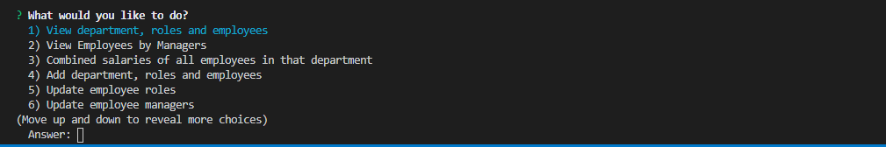

# Project Note Taker

## Description
This application allows the user to manage their employees. This interface allows the user to update, add and delete employees, roles and departments within the organization. Application also allows for a clearer understanding of organizational hierarchy. Interface was developed through the use of inquirer, from which the users response is transformed into a sql query and thus the user recieves a response from the sql data base. 

## User Story

As a business owner
I want to be able to view and manage the departments, roles, and employees in my company
So that I can organize and plan my business

## Business Context

For users that need to keep track of its employees and its organizational structure, it's easy to forget needed employee details. Being able to retrieve such information from a persistent and dynamic database is essential for business recording keeping and record keeping efficiency.

## Image

## Link
https://github.com/sid-666/EmployeeTracker